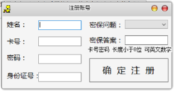
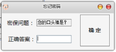
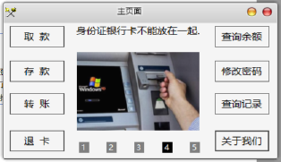
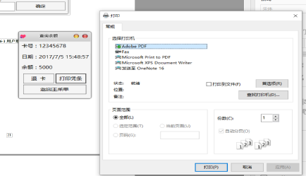
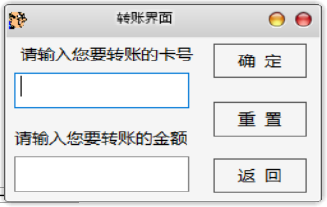

# ATM自动柜台机系统

> 使用 WinForm + SQL 实现了一个简易美观的ATM系统

## 背景

1. 实训项目（*本人大一学生党，不得不向恶势力低头...*）

2. 锻炼自己的水平

   

## 技术栈
1. 前端: WinForm
2. 后端: C#
3. 数据库: SQL 2016

## 环境
1. 系统 Win10专业版 1709
3. 数据库 SQL 2008R2 | SQL 2016
4. C# 4.5框架 （向下兼容）
4. 编辑器 Visual Studio 2017 15.15.2 

## 截图

